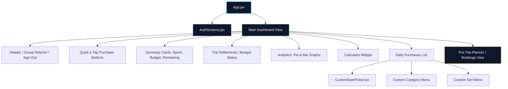
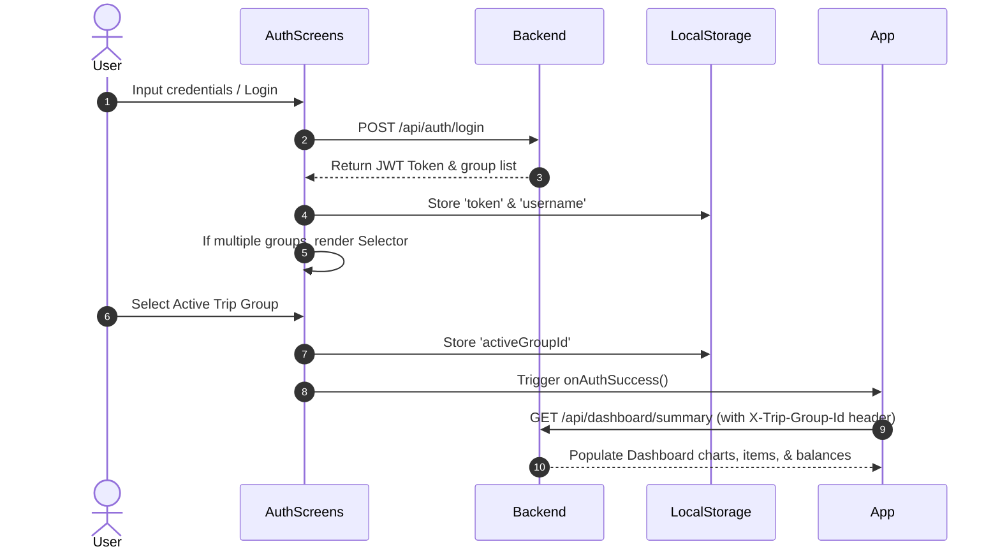

<div align="center">


[](https://react.dev/)
[](https://vitejs.dev/)
[](https://tailwindcss.com/)
[](https://www.framer.com/motion/)

[](https://tour-expence-tracker-frontend.vercel.app/)
[](https://github.com/ashrithBalaji456/Tour_Expence_Tracker_Backend)

</div>

---

## 📱 About

This repository contains the client-side single page application (SPA) for the **Tour Expense Tracker**. It delivers a high-fidelity glassmorphic dark interface to manage trip planning, log daily purchases in real time, and execute peer-to-peer balance settlements.

🔗 **Live Application:** [tour-expence-tracker-frontend.vercel.app](https://tour-expence-tracker-frontend.vercel.app/)
🔗 **Backend Repo:** [Tour_Expence_Tracker_Backend](https://github.com/ashrithBalaji456/Tour_Expence_Tracker_Backend)

---

## 🎨 Premium UI & Interactive Features

- **Glassmorphic Dark Theme** — translucent frosted panels, glowing hover feedback, curated color palette
- **Framer Motion micro-animations** — fluid transitions across login, dashboard, modals, and filter toggles
- **Unified Analytics** — Recharts donut chart for category spend + a daily outflow timeline bar chart that auto-excludes internal cash settlements
- **Custom Form Controls** — click-outside-aware React dropdowns replacing native date pickers, category selects, and sort menus
- **Group Management** — create trip groups, invite members, switch between active trips, admin-only deletion

---

## 🧩 Component Architecture



---

## 📊 Client-Side State & Session Flow



---

## 🖼️ User Journey


---

## 🛠️ Local Setup & Installation

### Prerequisites
- Node.js (v18+)
- npm (v9+)

### Step 1: Clone Repository
```bash
git clone https://github.com/ashrithBalaji456/Tour_Expence_Tracker_Frontend.git
cd Tour_Expence_Tracker_Frontend
```

### Step 2: Install Project Dependencies
```bash
npm install
```

### Step 3: Configure Environment Variables
Create a `.env` file in the root folder:
```env
VITE_API_URL=http://localhost:8080/api
```

### Step 4: Launch Developer Server
```bash
npm run dev
```
Open `http://localhost:3001` in your browser to inspect the application.

---

## ⚡ Deployment to Vercel (Production)

The project is fully pre-configured for automated production pipelines on Vercel:

1. Connect your GitHub repository to Vercel.
2. Set the **Build Command** to: `npm run build`
3. Set the **Output Directory** to: `dist`
4. Configure the environment variable `VITE_API_URL` to point to your live deployed backend URL (e.g. `https://tour-expence-tracker-backend.onrender.com/api`).
5. Click **Deploy**!

---

<div align="center">


</div>
