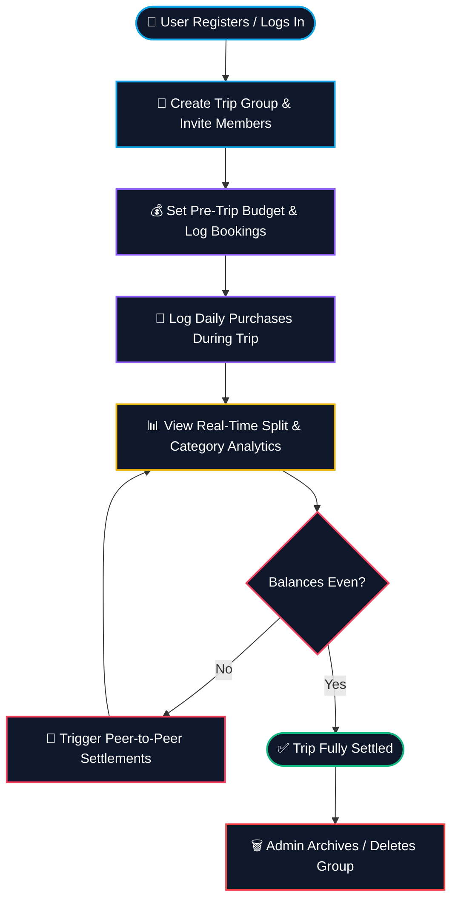
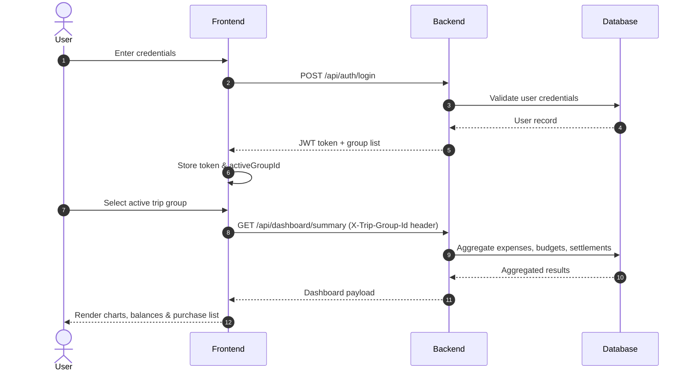
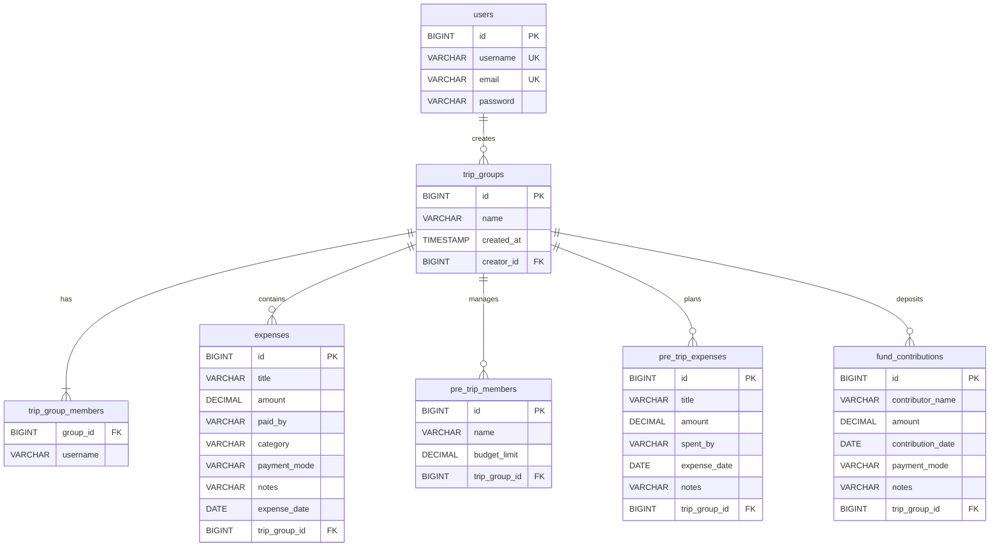
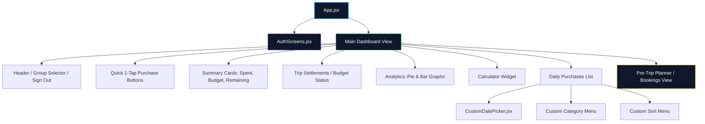
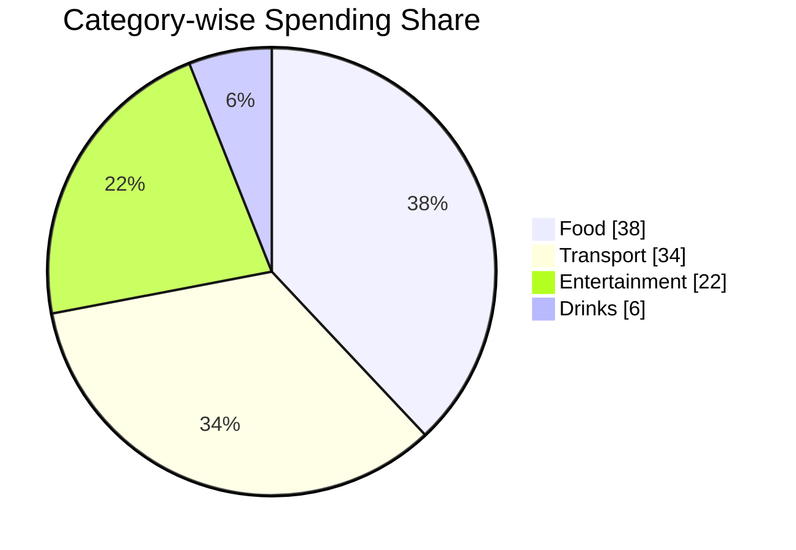

<div align="center">


<a href="https://tour-expence-tracker-frontend.vercel.app/">
  
</a>

<br/>

[](https://tour-expence-tracker-frontend.vercel.app/)
[](https://github.com/ashrithBalaji456/Tour_Expence_Tracker_Frontend)
[](https://github.com/ashrithBalaji456/Tour_Expence_Tracker_Backend)


</div>

---

## 📖 About the Project

**Tour Expense Tracker** is a full-stack web application built to solve a very real, very annoying problem — **splitting group trip expenses fairly without the WhatsApp-math chaos**.

It has two coordinated phases:
- **Pre-Trip Planning** — log upfront bookings (train tickets, hotel advances, deposits) and see a fair split before the trip even begins.
- **Active Trip Tracking** — log every daily purchase (food, transport, drinks, entertainment) in real time, and instantly see who owes whom, down to the rupee.

The entire debt web collapses into the **minimum number of settlements** needed to clear everyone's balance — no manual reconciliation required.

> 🧳 This app was built and actually used on a real group trip (Goa 2026) to track ₹30,000+ in shared spending across multiple members, categories, and payment modes.

---

## 🗂️ Repository Structure

| Repo | Description | Link |
|---|---|---|
| 🖥️ **Frontend** | React + Vite + TailwindCSS SPA, deployed on Vercel | [Tour_Expence_Tracker_Frontend](https://github.com/ashrithBalaji456/Tour_Expence_Tracker_Frontend) |
| ⚙️ **Backend** | Spring Boot + PostgreSQL REST API, deployed on Render | [Tour_Expence_Tracker_Backend](https://github.com/ashrithBalaji456/Tour_Expence_Tracker_Backend) |
| 🌐 **Live App** | Production deployment | [tour-expence-tracker-frontend.vercel.app](https://tour-expence-tracker-frontend.vercel.app/) |

---

## ✨ Feature Highlights

<table>
<tr>
<td width="50%" valign="top">

### 🎨 Frontend
- Glassmorphic dark dashboard UI
- Framer Motion micro-animations across screens & modals
- Recharts-powered analytics (donut + bar charts)
- Custom click-outside-aware dropdowns (dates, categories, sorting)
- Express 1-tap purchase logging
- Multi-group support with admin-only trip deletion

</td>
<td width="50%" valign="top">

### ⚙️ Backend
- Stateless JWT authentication (24h token expiry)
- Trip-group scope isolation via request headers
- Dual-phase split engine (pre-trip vs active spends)
- Self-healing DB constraint patches on startup
- Optimized P2P settlement algorithm (minimum transfers)
- Clean REST API with full CRUD on expenses & bookings

</td>
</tr>
</table>

---

## 🔄 End-to-End Application Workflow



---

## 🔐 Auth & Session Sequence



---

## 🧮 Settlement Calculation Flow


---

## 🗄️ Database Entity Relationship Diagram



---

## 🧩 Frontend Component Architecture



---

## 📊 Category Spend Distribution (Sample Trip Data)



---

## 🛠️ Tech Stack

<div align="center">

| Layer | Technology |
|---|---|
| Frontend Framework | React 18 + Vite 5 |
| Styling | TailwindCSS 3.4 |
| Animation | Framer Motion 11 |
| Charts | Recharts |
| Backend Framework | Spring Boot 3.2.5 (Java 17) |
| Database | PostgreSQL 15 |
| Auth | Stateless JWT |
| Build Tool | Maven |
| Frontend Hosting | Vercel |
| Backend Hosting | Render (Docker) |

</div>

---

## 🔌 Core API Endpoints

| Category | Method | Endpoint | Description |
|---|---|---|---|
| Auth | `POST` | `/api/auth/register` | Register a new user |
| Auth | `POST` | `/api/auth/login` | Login & retrieve JWT |
| Group | `POST` | `/api/auth/group` | Create trip group & invite members |
| Group | `GET` | `/api/auth/groups` | List groups the user belongs to |
| Group | `DELETE` | `/api/auth/group/{id}` | Delete a trip group (admin only) |
| Dashboard | `GET` | `/api/dashboard/summary` | Combined budget, spend & settlement data |
| Expenses | `GET / POST / PUT / DELETE` | `/api/expenses` | Full CRUD on daily purchases |
| Pre-Trip | `GET / POST` | `/api/pretrip/members` | Manage pre-trip budgets |
| Pre-Trip | `GET` | `/api/pretrip/summary` | Pre-trip split analysis |
| Funds | `GET / POST` | `/api/funds` | Cash pool contributions |

---

## 🚀 Quick Start

```bash
# 1. Clone both repositories
git clone https://github.com/ashrithBalaji456/Tour_Expence_Tracker_Frontend.git
git clone https://github.com/ashrithBalaji456/Tour_Expence_Tracker_Backend.git

# 2. Start the backend (Java 17 + Maven + PostgreSQL required)
cd Tour_Expence_Tracker_Backend
mvn spring-boot:run

# 3. Start the frontend (in a separate terminal)
cd Tour_Expence_Tracker_Frontend
npm install
npm run dev
```

Full setup instructions live in each repo's dedicated README (linked above).

---

## 🌐 Try It Live

<div align="center">

[](https://tour-expence-tracker-frontend.vercel.app/)

⚠️ *Backend is hosted on Render's free tier — the first request may take 30–60s to spin up the server from a cold start.*

</div>

---

## 🗺️ Roadmap

- [ ] Multi-currency support
- [ ] Expense receipt image uploads
- [ ] Push notifications for settlement reminders
- [ ] Faster free-tier backend hosting (Railway / Fly.io evaluation)
- [ ] Export trip summary as PDF

---

<div align="center">


Made with ☕, ₹ math, and one very persistent group chat.

</div>
